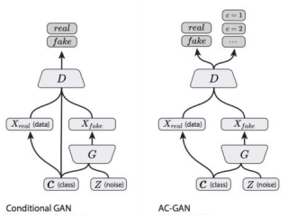

# Generate Faces with Specific Attributes on CelebA

## Introduction
Generative Adversarial Network, or GANs, are architecture for training generative models, such as deep convolutional neural network for generating faces which we done in this project.

In this project we try to develop a conditional GAN, or cGAN in short, for CelebA dataset. Our purposes are to generate Faces from a vector arithmetic in latent space while teaching it some conditions, in this case some specific labels related to faces like color of hair, shape of noise being young or old and etc.

We use **CelebA** data set from www.Kaggle.com as our data sources.

Our codes are in python programming langue and we use Google COLAB to run our codes. **KERAS** Library is used to developing architects of network in this project.

> Generative adversarial nets can be extended to a conditional model if both the generator and discriminator are conditioned on some extra information y. [...] We can perform the conditioning by feeding y into the both the discriminator and generator as additional input layer. [Conditional Generative Adversarial Nets, 2014]

## Model
In this project we use two different model to train our network:
1. Normal Conditional GAN (cGAN)
2. Auxiliary Classifier Conditional GAN (ac_GAN)

### 1. Normal Conditional GAN:
Alternatively, to simple GAN models, we can train these models in such a way that both the generator and the discriminator models get conditioned on the class labels which in our case is attributes relating to faces.

In figure below you can see our general architect of cGAN and how discriminator and generator connected with each other. Other important notion that can be seen from figure below is the way how we feed our labels to network.

#### Discriminator
Discriminator Input in this network is images of shape 28*28*3 pixel and 40 labels for each image. Output of this model is a binary number between 0 and 1 which have specific definitions. 0 means that given image is fake images which generated by generator and 1 means that it is real image from dataset.

First problem that we get encounter during this project was this section. How we can feed more than one labels to network? We use an Input layer from Keras library with shape of (40,) and then the class labels are passed through an EMBEDING layer with size of 128 which means that every labels map into a 128-element vector representation that will learned by discriminator and then by using CONCATENATION Layer between inserting image and labels which now converted to the same shape as image, it gets ready to classifier as real or fake images.

By using **Conv2D** Layer with **Stride of 2** we down Sample our images to single value of zero or one. For this purpose, we use Sigmoid Activation for last layer of discriminator.

In this model we need to train our discriminator so we compile it with **Adam optimizer** with **Learning Rate = 0.0002** and **Beta_1 = 0.5**. we use **Binary_CrossEntropy** for sake of loss function. Of course, because we have only one output, we use **Accuracy = Metric** to have a clear observation of system performance.

You can see our Discriminator Layers with corresponding shape of each layer in Figure 2.

#### Generator
Generator input in this network is **<Latent_Dim>** (which in our case is a 128-dimension hypersphere with each variable drawn from a Gaussian distribution with mean of zero and standard deviation of one) which we use **randn** method of **random** library in **Numpy**. Real label drawn from dataset. We use real labels here because some labels are in contradiction with each other. For example, a face cannot have a blond hair and black hair in same time which make it hard to generate real labels. And just like our Discriminator class labels pass through an **EMBEDDING Layer** with size of 128-element vector.

In this case we resize our feature map of labels to a single 4*4 feature map on the other hand by using a **Dense layer** we reconstruct our latent dim in size of 128*4*4 and the by using **Reshape layer** we add this single feature map of labels to latent dim. Then by using **Conv2DTranspose layer** and **Stride=2** we up sample our feature to a real size picture.

In this model our Generator is not going to train directly So we don’t need compile it here.

### GAN:
In next level we define a GAN model by combining the Generator model and the Discriminator model. This model is going to use train weights in generator model. Because Discriminator model trained separately it’s weights marked as untrainable in this level to ensure that only weights of generator going to update. This Larger model take points in latent space as input to generate an image which is going to feed as input to discriminator model, then classified as real or fake as output. We use same arguments for our optimizer and loss function in this model as our discriminator model.

In shape below you can see our Discriminator and Generator Layers all together:

###Training Model:
For sake of training, we use first 180000 image as training set and remaining images for evaluation. We set number of epochs to 40 and batch size to 128. For sake of updating **Discriminator** first we use half of batch (64) number of real images and their related labels which chosen randomly from training set. Second, we use half of batch number of generated images from generator and same labels used for real images in previous step. Actually, we train **Discriminator twice**. First for real mages with labels of 1 to learn it to know real images and second for Generated images with labels of 0 to learn it to know fake images.

For training our generator we use our **GAN model** which is a combine model of our Discriminator and Generator. Here we use exactly batch size number (128) of fake images generated through generator and same number of labels which extracted randomly through real labels with labels of 1. We use label 1 here because we want to make Discriminator to think that generated images are real so in backpropagation make our generator to update himself to generate better images.

## 2 – Auxiliary Classifier GAN (AC-GAN)
The Auxiliary Classifier GAN, or AC-GAN for short, is an extension of the conditional GAN that changes the discriminator to predict the class label of a given image rather than receive it as input. It has the effect of stabilizing the training process and allowing the generation of large high-quality images whilst learning a representation in the latent space that is independent of the class label.

In this model same as previous model our Generator model is provided both with a point in Latent Space and the class labels as input.

The main difference is in the discriminator model, which is only provided with the image as input, unlike the conditional GAN that is provided with the image and class label as input. The discriminator model must then predict whether the given image is real or fake as before, and must also predict the class label of the image.

In our model we use one single network with two output for Discriminator model. So, in practice our Discriminator as first output indicate realness of input image and is optimized using **Binary_CrossEntropy** like a normal GAN. The second output is a probability of the image belonging to each class via the SoftMax activation function and is optimized using **Binary_CrossEntropy** because our labels are 0 and 1. To summarize:

- Generator Model:
  - Input: Random point from the latent space, and the class label. 
  - Output: Generatedimage.

- Discriminator Model: 
  - Input: Image
  - Output: Probability that the provided image is real, probability of the image belonging to each known class.

The plot blow summarize input and out of Conditional Gan and AC-GAN input and output and best way to compared the CGAN and AC-GAN context:

### Discriminator:
As we mention before our discriminator in this model only take image as input. In our model we use discriminator as both probability of realness of images and probability of each image labels belonging to its class. So, in this model we have two different output which as a result we should train it with two loss function. 

Here we use exactly same loss function as previous model (cGAN) Binary_CrossEntropy and ADAM optimizer with learning rate of 0.0002 and beta_1=0. And again, we use 

Conv2D method of Keras Library with stride of 2 to down sample our images.
### Generator:
Main difference between this model and previous model in our project related to this section. At first, we try to use the same architect for our generator which means using embedding layer for feeding our labels into network. As result generated images was good but we lost the power to generate images with condition. With changing condition nothing happens in generated new images. So, we change it.

In this Model we feed labels to Latent Point which generated from latent space and have size of 128 directly. We use an Input layer with shape of Latent_dim (128) + label size (40). And then we reconstruct it in size of 256*8*8 and the by using Reshape we instruct of feature maps. Then by using Conv2DTranspose layer and Stride=2 we up sample our feature to a real size picture.

After some try and error steps, we add Batch Normalization layer into this model for sake of better result. And same as before we don’t compile model here.

## AC-GAN:
As we mention before generator model is not updated directly; instead, it is updated via the discriminator model. This can be achieved by creating a composite model that stacks the generator model on top of the discriminator model. The input to this composite model is the input to the generator model, namely a random point from the latent space and a class label. The generator model is connected directly to the discriminator model, which takes the generated image directly as input. Finally, the discriminator model predicts both the realness of the generated image and the class label. As such, the composite model is optimized using two loss functions, one for each output of the discriminator model.

Here we use same loss function and optimizer as our Discriminator model with a little difference. Here for our optimizer, we set learning rate to 0000.5 which again because of better result that we got in this case.

In plot below you can see our Discriminator and Generator Layers all together:

### Training Model:
We use the same condition as previous model here. We train model for 50 epochs with 128 Batch size. We train discriminator twice, once for real images and once for generated images through generator, each time with half of batch size. And then train generator with our combine mode of AC-GAN with Batch Size number of images with label of 1 again.
### FID SCORE:
The Frechet Inception Distance score, or FID for short, is a metric that calculates the distance between feature vectors calculated for real and generated images. The score summarizes how similar the two groups are in terms of statistics on computer vision features of the raw images calculated using the inception v3 model used for image classification. Lower scores indicate the two groups of images are more similar, or have more similar statistics, with a perfect score being 0.0 indicating that the two groups of images are identical.

For evaluation our model we use InceptionV3. This model estimates quality of generated images based on one of 1000 known object. The FID score is calculated by first loading a pre- trained Inception v3 model. The output layer of the model is removed and the output is taken as the activations from the last pooling layer, a global spatial pooling layer. The FID score is calculated using the following equation taken from the papres:

In our project of course because of differences between Generator models and how they generate images we need to have two different evaluation.

Here we compute FID score with 10000 images chosen randomly from real images fo testing set. We use same labels to generate 10000 images to compute FID Score.

## Result:
As result of course each model works well to generate images according to custom labels. But as expected AC_GAN model generates better images than cGAN.

